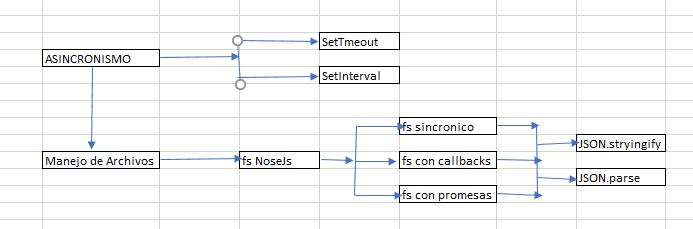

# CLASE Nª 4 MANEJO DE ARCHIVOS

- Programacion sincrónica y asincronica para el manejo de ARCHIVOS
- concocer el modulo nativo de nodejs para interactuar con ARCHIVOS
- utilizar archivos con callbacks y promesas
- ventajas y desventajas de Filesystem

## MAPA CONCEPTUAL



## SINCRONISMO

## ASINCRONISMO

## setTimeOut

```js
// ejemplo sencillo
console.log("Tareas 1");

setTimeout(() => {
  console.log("Tarea 2");
}, 2000);

console.log("Tarea 3");

// Ejemplo mas elaborado

const temporizador = (callback) => {
  setTimeout(() => {
    callback();
  }, 2000);
};

const operacion = () => console.log("Tarea 5");

console.log("Tares 4");
temporizador(operacion);
console.log("Tarea 6");
```

## setInterval

- Es una función que permite ejecutar codigo cada cierto tiempo hasta que se realice un clearInterval

ejemplo

```js
const contador = () => {
  let contador = 1;
  console.log("Iniciando el contador");

  let timer = setInterval(() => {
    contador++;
    if (contador > 10) {
      clearInterval(timer);
    }
    console.log(`Èjecutando el Timer ${contador}`);
  }, 1000);
};

console.log("Antes del contador");

contador();

console.log("Luego del contador");
```

## Manejo de Archivos

- Ventaja _Persistencia de los datos_
- fs, módulo nativo en Nodejs
- Perimte crear, leer, eliminar, saber si existe, determinar el tamaño entre otras funciones

### Como incluir fs en nuestro ejemplo

```js
import fs from "fs";
console.log(fs);
```

En consola me muestra todos los métodos de fs

### Usando fs de manera asincrona (bloqueante)

- writeFileSybc: Para escribir el contenido en un archivo. Si no existe lo crea y si existe lo sobre escribe
- readFilesync: Sirve para obtener el contenido de un atrchivo
- appendFilesync: Es utilizado para añadir cotenido a un archivo "NO sobreescribe"
- unlinkFileSync: Elimina todo el archivo
- existsSync: Para saber si un archivo existe

_Ejemplo_

```js
import fs from "fs";
// Escribiendo contenido en un archivo
const data = "Escribiendo datos en un archivo";
const name = "./firstFile.txt";
console.log(data);

fs.writeFileSync(name, data);

// VErificar que exista el

if (fs.existsSync(name)) {
  console.log(`El Archivo ${name} si Existe'`);
  const dataRead = fs.readFileSync(name, "utf-8");

  //Leyendo un archivo
  console.log("**** El contenido es el siguientye");
  console.log(dataRead);
}

//Agregar contenido a un archivo

const newLine = "\nEs una nueva linea del archivo";
if (fs.existsSync(name)) {
  //Agegando la nueva linea
  fs.appendFileSync(name, newLine);

  //Leyendo el contenido
  const newContent = fs.readFileSync(name, "utf-8");
  console.log(`El contenido del archivo es \n ${newContent}`);

  //Eliminar el archivo
  console.log("eliminando el archivo");
  fs.unlinkSync(name);
}
```

### usando fs con callback

Los métodos disponibles son:

- writeFile idem al modo sincrono pero en el callback devuelve (error)=>
- reaadFile: para leer el contenido de un archivo, y el el callback tiene la forma (error, resultado) =>
- appendfile: Añade datos al archivo y el callback solo maneja (errpr)=>
- unlink Elimina un archivo y el callback solo devuelve (error)=>

\*Problema que se puede presentar es la anidacion de callbacl **_CALLBACK HELL_**

\*ejemplo

```js
import fs, { writeFile } from "fs";
// Escribiendo contenido en un archivo
const data = "Escribiendo datos en un archivo";
const newLine = "\nEs una nueva linea del archivo";

const name = "./callbackFile.txt";

console.log(data);

fs.writeFile(name, data, (error) => {
  if (error) {
    return console.log("Hubo un error al crear el archivo");
  }

  //Leer el archivo
  fs.readFile(name, "utf-8", (error, contenido) => {
    if (error) {
      return console.log("Hubo un error al leer el archivo");
    }
    console.log(contenido);
  });

  //Agregar datos al archivo
  fs.appendFile(name, newLine, (error) => {
    if (error) {
      return console.log("Hubo error al agregar datos al atrchivo");
    }

    fs.readFile(name, "utf-8", (error, newContent) => {
      if (error) {
        console.log("Hubo error al leer el archivo actualizado");
      }
      console.log(`El nuevo contenido es \n ${newContent}`);
    });
  });
});
```

### fs utilizando promesas

Es la forma de manejar fs en modo asincrono, para lo cual se agrega .promises al módulo
entonces se puede hacer uso de .then, .catch
Los métodos disponibles son:

- fs.promises.writeFile
- fs.promises.readFile
- fs.promises.appendFile
- fs.promises.unlink

**_ ejemplo _**

```js
import fs from "fs";

const operaciones = async (filename, content, newContent) => {
  try {
    console.log("Se va a crear un archivo");

    await fs.promises.writeFile(filename, content);

    console.log("El contenido del archivo creado es :");
    let contenido = await fs.promises.readFile(filename, "utf-8");
    console.log(contenido);

    console.log("Ahora vamos a agregar mas contenido al archivo");
    await fs.promises.appendFile(filename, newContent);

    console.log("El contenido del archivo actualizado es :");
    contenido = await fs.promises.readFile(filename, "utf-8");
    console.log(contenido);

    console.log("Vamos a eliminar el archivo");

    await fs.promises.unlink(filename);
  } catch (error) {
    console.log("Hubo un error");
  }
};

operaciones(
  "./fspromises.txt",
  "Contenido inicial del archivo\n segunda linea del archivo\n",
  "Contenido Adicional del archivo"
);
```

### Manejo de datos cmoplejos

- JSON.stringify() Objeto to Teto
- JSON.PARSE() TExto to Objeto

Existe una página que brinda json de pruebas [https://jsonplaceholder.typicode.com/guide/]

### Actividad en clase

```js
import fs from "fs";

const name = "./package.json";

const actividad = async (filename) => {
  try {
    const data = await fs.promises.readFile(filename, "utf-8");
    const stats = await fs.promises.stat(filename);

    const info = {
      contenidoStr: data,
      contenidoObj: JSON.parse(data),
      size: stats.size,
    };
    console.log(info);
  } catch (error) {
    console.log("Hubo un error");
    console.log(error);
  }
};

actividad(name);
```

### Hands on lab

Manager de usuarios
Crear una clase que permita gestionar usuarios usando fs.promises, este deberá contrar con solo dos métodos: Crear un usuario y consultas los usuarios guardados.

```js
import fs from "fs";

class managerUser {
  constructor(fileName) {
    this.fileName = fileName;
    if (fs.existsSync(fileName)) {
      try {
        let usuarios = fs.readFileSync(fileName, "utf-8");
        this.usuarios = JSON.parse(usuarios);
      } catch (error) {
        this.usuarios = [];
      }
    } else {
      this.usuarios = [];
    }
    // console.log(`el archivo ${fileName} No existe !!!`);
  }

  async saveFile(data) {
    try {
      await fs.promises.writeFile(
        this.fileName,
        JSON.stringify(data, null, "\t")
      );
      return true;
    } catch (error) {
      console.log(error);
      return false;
    }
  }

  async createUser(usuario) {
    this.usuarios.push(usuario);

    const respuesta = await this.saveFile(this.usuarios);

    if (respuesta) {
      console.log("Usuario creado");
    } else {
      console.log("Hubo un error");
    }
  }

  getUser() {
    console.log(this.usuarios);
  }
}

class Usuario {
  constructor(nombre, apellido, edad, curso) {
    this.nombre = nombre;
    this.apellido = apellido;
    this.edad = edad;
    this.curso = curso;
  }
}

const usr1 = new Usuario("mario", "campos", 57, "1");
const usr2 = new Usuario("cesar", "campos", 57, "1");
const usr3 = new Usuario("fernando", "campos", 57, "1");
const usr4 = new Usuario("claudia", "campos", 57, "1");

const name = "./usuarios.json";
const usuarioControlador = new managerUser(name);

usuarioControlador.createUser(usr1);
usuarioControlador.createUser(usr2);
usuarioControlador.createUser(usr3);
usuarioControlador.createUser(usr4);

usuarioControlador.getUser();
```

### Fin de la clase 4
